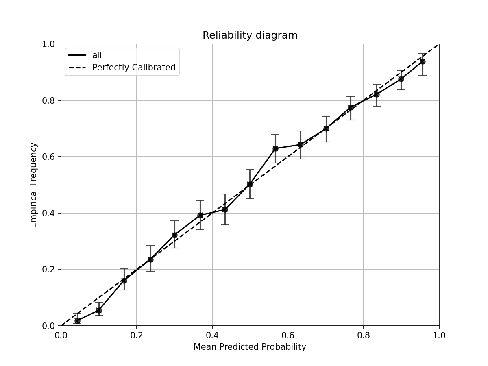

# Summary
`calzone` is a Python package for evaluating the calibration of probabilistic outputs of classifier models. It provides a set of functions for visualizing calibration and computing of calibration metrics given a representative dataset with the model's predictions and the true class labels. The metrics provided in `calzone` include: Expected Calibration Error (ECE), Maximum Calibration Error (MCE), Hosmer-Lemeshow (HL) statistic, Integrated Calibration Index (ICI), Spiegelhalter's Z-statistics and Cox's calibration slope/intercept. The package is designed with versatility in mind. For many of the metrics, users can adjust the binning scheme and toggle between top-class or class-wise calculations. 

# Statement of need
Classification is one of the most common applications in machine learning. Examination of the discrimination performance (resolution), such as Area under the curve (AUC) or Sensitivty(Se, also known as true positive rate or Specifity(Sp, also known as 1 - false positive rate) are also used to evaluate model performance @statistical_learning. These metrics may be sufficient if the output of the model is not meant to be a calibrated probability.

@DIAMOND199285 showed that the resolution (i.e., high performance) of a model does not indicate the reliability/calibration of the model. Calibration is the agreement between predicted and true probabilities, $P(D=1|\hat{p}=p) = p$, defined as moderate calibration by @Calster_weak_cal and also known as model reliability. @Brocker_decompose later showed that any proper scoring rule can be decomposed into the resolution and reliability. Thus, a model with high resolution may still lack reliability. In high-risk applications like medical diagnosis, reliability aids interpretability for treatment decisions.


 While existing libraries such as `scikit-learn` include basic tools like reliability diagrams and expected calibration error, they lack support for more comprehensive and flexible evaluation metrics—such as reliability diagrams with error bars, class-conditional calibration error, different binning schemes, or statistical significance testing for miscalibration. Other libraries, such as `ml-calibration`, `uncertainty-toolbox`, and `pycaleva`, primarily focus on only one aspect of calibration. For example, `ml-calibration` provides advanced controls for plotting reliability diagrams and computing smooth expected calibration error but does not include statistical tests for miscalibration [@ml-calibration]. The `uncertainty-toolbox` focuses on calibration methods rather than assessment [@uncertaintyToolbox]. The `pycaleva` package overlaps with many functionalities in calzone, but it does not support Cox's calibration analysis, Wald intervals for reliability, or custom curve fitting methods for expected calibration error [@pycaleva].

 The `calzone` package offers functions and classes for visualizing and evaluating calibration metrics using representative datasets.

In contrast, calzone emphasizes diagnostic tools for calibration assessment. It includes a wider set of calibration metrics, statistical tests (e.g., hypothesis testing for miscalibration), and visualization tools tailored for classification tasks with multiple classes. The package is designed to help users not only visualize miscalibration but also quantify and statistically validate it in a consistent and interpretable way.

# Software description

## Input data
To evaluate the calibration of a model, users need a representative dataset from the intended population. The dataset should contain the true class labels and the model's predicted probabilities. In `calzone`, the dataset can be a CSV file or two NumPy arrays containing true labels and predicted probabilities.

## Reliability Diagram

The reliability diagram is a graphical representation of the calibration[@Murphy_reliability;@Brocker_reldia]. It groups the predicted probabilities into bins and plots the mean predicted probability against the empirical frequency in each bin. The reliability diagram can be used to qualitatively assess the calibration of the model. The confidence intervals of the empirical frequency are calculated using the Wilson's score interval [@wilson_interval].
```python
from calzone.utils import reliability_diagram
from calzone.vis import plot_reliability_diagram
reliability, confidence, bin_edges, bin_counts = reliability_diagram(
    labels,
    probs,
    num_bins=15,
    class_to_plot=1
) 

plot_reliability_diagram(
    reliability,
    confidence,
    bin_counts,
    error_bar=True,
    title='Reliability diagram'
    
)
```


## Calibration metrics

`calzone` provides functions to compute various calibration metrics, including methods to compute expected calibration error and statistical tests to assess calibration. These functions provide quantitative metrics for users to evaluate the calibration performance of the model. The `CalibrationMetrics()` class allows the user to compute the calibration metrics in a more convenient way. The following are metrics that are currently supported in `calzone`: 

### Expected Calibration Error (ECE) and Maximum Calibration Error (MCE)
Expected Calibration Error (ECE) and Maximum Calibration Error (MCE) [@guo_calibration;@Naeini_ece] measure the average and maximum deviation between predicted and true probabilities. `calzone` supports equal-width (ECE-H) and equal-count (ECE-C) binning. Users can compute these metrics for the top-class (highest probability) or class-of-interest (one-vs-rest classification).

### Hosmer-Lemeshow statistic (HL)
The Hosmer-Lemeshow (HL) test [@hl_test] evaluates model calibration using a chi-square test comparing observed and expected events in bins. The null hypothesis is that the model is well calibrated. `calzone` supports equal-width (ECE-H) and equal-count (ECE-C) binning. The test statistic is:
$$
\text{HL} = \sum_{m=1}^{M} \frac{(O_{1,m}-E_{1,m})^2}{E_{1,m}\left(1-\frac{E_{1,m}}{N_m}\right)}  \sim \chi^2_{M-2}
$$
where $E_{1,m}$ and $O_{1,m}$ are the expected and observed events in the $m^{th}$ bin, $N_m$ is the total observations in the bin, and $M$ is the number of bins. For validation sets, the degrees of freedom change from $M-2$ to $M$ [@hosmer2013applied]. The increase in degree of freedom for validation samples has often been overlooked but it is crucial for the test to maintain the correct type 1 error rate. In `calzone`, the default is $M-2$, adjustable via the `df` parameter.

### Cox's calibration slope/intercept
Cox's calibration slope/intercept assesses model calibration without binning [@Cox]. A logistic regression is fit with predicted odds ($\frac{p}{1-p}$) as the independent variable and the outcome as the dependent variable. Perfect calibration is indicated by a slope of 1 and intercept of 0. To test calibration, fit the intercept with slope fixed at 1; if the intercept differs from 0, the model is not calibrated. Similarly, fit the slope with intercept fixed at 0; if the slope differs from 1, the model is not calibrated. Alternatively, fit both simultaneously using a bivariate distribution [@McCullagh:1989]. This feature is not in `calzone`, but users can manually test using the covariance matrix.

A slope >1 indicates overconfidence at high probabilities and underconfidence at low probabilities, while a slope <1 indicates the opposite. A positive intercept indicates general overconfidence. Even with ideal slope and intercept, non-linear miscalibration may still exist.

### Integrated calibration index (ICI)
The Integrated Calibration Index (ICI) measures the average deviation between predicted and true probabilities using curve smoothing techniques [@ICI_austin]. It is calculated as:
$$
\text{ICI} = \frac{1}{n}\sum_{i=1}^{n} |f(p_i)-p_i|
$$
where $f$ is the fitting function and $p$ is the predicted probability. Typically, Locally Weighted Scatterplot Smoothing (LOWESS) is used, but any curve fitting method can be applied. `calzone` supports both Cox ICI and LOWESS ICI, allowing users to choose their preferred method. Users should visualize the fitting results to avoid overfitting or underfitting, as flexible methods like LOWESS are sensitive to span and delta parameters.

### Spiegelhalter's Z-test

Spiegelhalter's Z-test is a test of calibration proposed by Spiegelhalter in 1986 [@spiegelhalter_z]. It uses the fact that the Brier score can be decomposed into:
$$
B = \frac{1}{N} \sum_{i=1}^N (x_i - p_i)^2 = \frac{1}{N} \sum_{i=1}^N (x_i - p_i)(1-2p_i) + \frac{1}{N} \sum_{i=1}^N p_i(1-p_i)
$$
And the test statistic (TS) of Z test is defined as:
$$
Z = \frac{B - E(B)}{\sqrt{\text{Var}(B)}} = \frac{ \sum_{i=1}^N (x_i - p_i)(1-2p_i)}{\sum_{i=1}^N (1-2p_i)^2 p_i (1-p_i)}
$$
and it is asymptotically distributed as a standard normal distribution. 

### Metrics class
`calzone` also provides a class called `CalibrationMetrics()` to calculate all the metrics mentioned above. The function will return a dictionary containing the metrics name and their values. The metrics can be specified as a list of strings. The string 'all' can be used to calculate all the metrics.

```python
from calzone.metrics import CalibrationMetrics

metrics = CalibrationMetrics(class_to_calculate=1)

metrics.calculate_metrics(
    labels,
    probs,
    metrics='all'
)
```
# Other features
## Confidence intervals

`calzone` also provides functionality to compute confidence intervals for all metrics using bootstrapping. The user can specify the number of bootstrap samples and the confidence level. 
```python
from calzone.metrics import CalibrationMetrics

metrics = CalibrationMetrics(class_to_calculate=1)

CalibrationMetrics.bootstrap(
    labels,
    probs,
    metrics='all',
    n_samples=1000
)
```
and a structured NumPy array will be returned.

## Subgroup analysis
`calzone` will perform subgroup analysis by default in the command line user interface. If the user input CSV file contains a subgroup column, the program will compute metrics for the entire dataset and for each subgroup. A detailed description of the input format can be found in the documentation.

## Prevalence adjustment
`calzone` offers prevalence adjustment to correct for differences in disease prevalence between training and testing data. Calibration is based on posterior probability, so a shift in prevalence can cause miscalibration. The adjusted probability is calculated as:
$$
P'(D=1|\hat{p}=p) = \frac{\eta'/(1-\eta')}{(1/p-1)(\eta/(1-\eta))} = p'
$$
where $\eta$ is the testing data prevalence, $\eta'$ is the training data prevalence, and $p$ is the predicted probability. The optimal $\eta'$ is found by minimizing cross-entropy loss, or users can specify $\eta'$ directly if known [@weijie_prevalence_adjustment;@prevalence_shift;@gu_likelihod_ratio;@Prevalence_HORSCH].

## Multiclass extension
`calzone` supports multiclass classification using a 1-vs-rest approach or top-class calibration. In top-class calibration, class 1 probability is the highest predicted probability, and class 0 is 1 minus this probability. Metrics interpretation may change in this transformation.

## Verification of methods
`calzone` results were compared with external packages for accuracy. Reliability diagrams were verified with `sklearn.calibration.calibration_curve()`[@scikit], top-class ECE and Spiegelhalter's Z scores with `MAPIE`[@taquet2022mapie], and Hosmer-Lemeshow statistic with `ResourceSelection` [@ResourceSelection] in R. Differences were within 0.1%, confirming consistency. Verification codes are in the documentation.

## Command line interface
`calzone` offers a command line interface for visualizing calibration curves, calculating metrics, and confidence intervals. Run `python cal_metrics.py -h` for help.

# Acknowledgements
The mention of commercial products, their sources, or their use in connection with material reported herein is not to be construed as either an actual or implied endorsement of such products by the Department of Health and Human Services. This is a contribution of the U.S. Food and Drug Administration and is not subject to copyright.

The authors acknowledge the Research Participation Program at the Center for Devices and Radiological Health administered by the Oak Ridge Institute for Science and Education through an interagency agreement between the U.S. Department of Energy and the U.S. Food and Drug Administration. 

# Conflicts of interest
The authors declare no conflicts of interest.

# References
